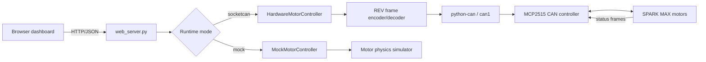

# WaveCan

WaveCan is a Raspberry Pi motor-control service for REV Robotics SPARK MAX controllers on a SocketCAN bus. It provides a browser dashboard, a JSON HTTP API, automatic motor discovery, direct output control, software velocity PID, telemetry decoding, and a mock simulator for development without hardware.

It also includes a Windows desktop controller that communicates directly with the Pi over paired Bluetooth Low Energy, allowing the laptop to keep its normal Wi-Fi connection. See [Bluetooth controller](docs/BLUETOOTH.md).

The recovered deployment targets a Raspberry Pi 4 Model B with a Waveshare dual-MCP2515 CAN HAT. `can1` is the active interface at 1 Mbit/s.

> [!CAUTION]
> The HTTP server has no authentication or authorization. In its default configuration it listens on `0.0.0.0:8080` and exposes motor-control, CAN-control, and Wi-Fi connection endpoints. Run it only on a trusted, isolated network until access control is added.

## How it works



`main.py` selects mock or hardware mode, discovers/configures motors, creates the controller and web server, enables the motors, and runs the HTTP server alongside a 5 ms controller loop. Hardware telemetry is decoded and exposed through `/api/status`; dashboard commands travel in the opposite direction and become 29-bit REV/FRC CAN frames.

See [Architecture](docs/ARCHITECTURE.md) for the full startup sequence, component responsibilities, CAN data flow, and operational caveats.

## Quick start: simulation

Requires Python 3.10 or newer.

```bash
python3 -m venv .venv
source .venv/bin/activate
python -m pip install -r requirements-dev.txt
WAVECAN_RUNTIME_MODE=mock python main.py
```

On Windows PowerShell, activate with `.venv\Scripts\Activate.ps1`, then set `$env:PYTHONUTF8 = "1"` and `$env:WAVECAN_RUNTIME_MODE = "mock"` before running `python main.py`.

Open `http://127.0.0.1:8080`.

## Raspberry Pi hardware mode

Install the Python dependency and bring up `can1`:

```bash
python3 -m pip install --user python-can
sudo cp systemd/setup-can.service /etc/systemd/system/
sudo systemctl daemon-reload
sudo systemctl enable --now setup-can.service

export WAVECAN_RUNTIME_MODE=socketcan
export WAVECAN_CAN_INTERFACE=can1
export WAVECAN_CAN_BITRATE=1000000
export WAVECAN_HTTP_HOST=0.0.0.0
python3 main.py
```

The included `wavecan.service` is a template and currently forces `mock` mode. Change that environment setting to `socketcan` before installing it for real motors. More installation details are in [INSTALL.md](INSTALL.md).

For Bluetooth control instead of the browser/hotspot workflow:

```bash
bash setup_bluetooth.sh
```

Then build or run the controller in `windows_app/`. The Bluetooth bridge has an independent 600 ms command watchdog that stops and disarms every motor after a lost connection.

## HTTP API

| Endpoint | Purpose |
| --- | --- |
| `GET /` or `/dashboard` | Serve the embedded dashboard |
| `GET /api/status` | Motor telemetry, controller capabilities, and CAN statistics |
| `GET /api/motors` | List configured/discovered motors |
| `GET /api/health` | Process uptime and CAN health |
| `POST /api/motor/cmd` | Set duty cycle, set target RPM, or stop PID |
| `POST /api/motor/pid` | Configure software PID gains and limits |
| `POST /api/can/open` | Open the CAN adapter |
| `POST /api/can/close` | Close the CAN adapter |
| `POST /api/network/connect` | Ask NetworkManager to join a Wi-Fi network |

Example direct-output command:

```bash
curl -X POST http://127.0.0.1:8080/api/motor/cmd \
  -H "Content-Type: application/json" \
  -d '{"id":1,"cmd":"set","value":0.25}'
```

`value` is normally `-1.0` to `1.0`; percent-like values from `-100` to `100` are normalized automatically.

## Configuration

| Variable | Default | Meaning |
| --- | --- | --- |
| `WAVECAN_RUNTIME_MODE` | `socketcan` on Linux, `mock` elsewhere | Controller/backend selection |
| `WAVECAN_CAN_INTERFACE` | `can1` | Linux SocketCAN interface |
| `WAVECAN_CAN_BITRATE` | `1000000` | Expected CAN bitrate |
| `WAVECAN_HTTP_HOST` | `0.0.0.0` | HTTP bind address |

The HTTP port is currently fixed at `8080` in `config.py`. Default fallback motor IDs are `1` through `6`; hardware mode first probes IDs `1` through `63` and uses detected devices when possible.

## Repository layout

- `main.py` — application entry point and concurrent control loop
- `web_server.py` / `dashboard.html` — raw asyncio HTTP server, API, and UI
- `hardware_motor_controller.py` — hardware state, output refresh, PID, and telemetry decode
- `socketcan_bus.py` — `python-can` transport, discovery, queues, and statistics
- `rev_sparkmax_protocol.py` — REV/FRC arbitration IDs and frame builders
- `mock_can.py` / `mock_sparkmax.py` — deterministic development simulator
- `network_manager.py` — connectivity check, Wi-Fi join, and hotspot fallback
- `bluetooth_bridge.py` / `bluetooth_protocol.py` — paired BLE service, motor watchdog, and wire protocol
- `windows_app/` — Windows Bluetooth controller and executable build script
- `systemd/` and `wavecan.service` — Pi boot/service templates
- `tools/` — recovered manual launcher and external sparkcan diagnostic probe
- `tests/` — protocol, controller, and simulation tests

## Verification status

The Pi working tree was recovered on August 23, 2026 after its local Git object database became corrupt. The source files were preserved, scanned for credentials, overlaid on the healthy GitHub history, and documented. See [Recovery notes](docs/RECOVERY.md).

The recovered suite plus Bluetooth protocol coverage currently reports **24 passing and 10 failing tests** in a clean Python 3.13 environment. Run it with:

```bash
python -m pytest -q
```

The remaining failures are recorded in the recovery notes and should be resolved before relying on the software for unattended physical motor control.

## License

No project license has been selected. The separate `sparkcan` library referenced by `tools/sparkcan_ref_probe.cpp` is MIT-licensed and is not vendored here.
