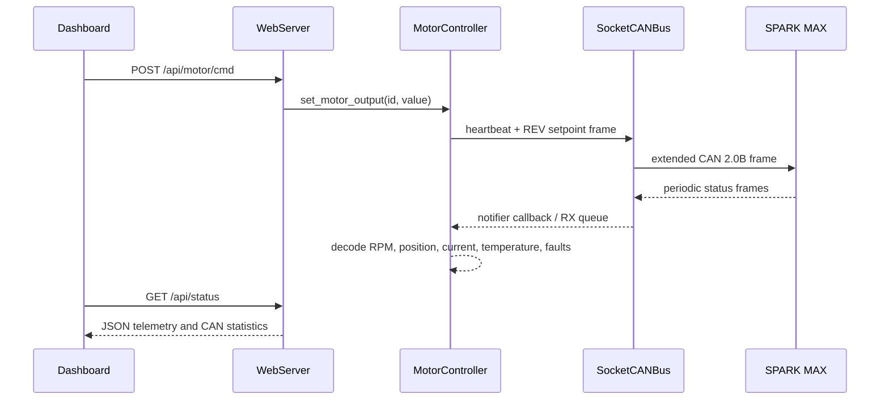

# WaveCan architecture

## Purpose

WaveCan connects a browser to multiple REV Robotics SPARK MAX motor controllers. The same entry point can run against a deterministic mock CAN/motor model or against Linux SocketCAN hardware.

## Startup sequence

`main.py` performs the following work:

1. `network_manager.ensure_network_available()` checks the wireless interface and internet reachability. If no connection is available, it attempts to create a `LUSI` hotspot through hostapd or NetworkManager.
2. `config.py` selects `socketcan` on Linux and `mock` elsewhere unless `WAVECAN_RUNTIME_MODE` overrides it.
3. `wavecan_platform.get_can_bus_class()` chooses `SocketCANBus` or `MockCANBus`.
4. Hardware mode actively probes SPARK MAX device IDs 1–63. If that finds nothing, it listens passively for 1.5 seconds. Configured IDs 1–6 are the fallback.
5. The app creates `HardwareMotorController` or `MockMotorController`, followed by `WebServer`.
6. All motors are enabled.
7. `asyncio.gather()` runs the raw HTTP server and a 5 ms controller loop together. Telemetry work is scheduled every 10 ms.

## Request and telemetry flow



## Components

### `web_server.py`

This is a small HTTP/1.1 server built directly on `asyncio.start_server`; it is not Flask or FastAPI. It parses request lines, headers, and JSON bodies, serves `dashboard.html`, and routes nine endpoints.

Direct-output requests accept a normalized value or a percentage. In hardware mode, rapid zero commands arriving immediately after a nonzero command are temporarily suppressed to avoid a UI gesture canceling itself. RPM requests use the hardware controller's software PID implementation.

There is no authentication, authorization, TLS, CSRF protection, or network-origin restriction. Any host that can reach port 8080 can attempt motor, CAN, and Wi-Fi operations.

### `hardware_motor_controller.py`

Each detected motor is represented by `HardwareMotorProxy`, which stores commanded output, decoded telemetry, communication state, faults, and PID state. The controller:

- sends a universal heartbeat at up to 20 ms intervals;
- refreshes active output commands on a 5 ms cadence;
- requests periodic status groups 0, 1, and 2 at 10 ms periods and refreshes that configuration every 3 seconds;
- decodes output, RPM, encoder position, temperature, current, voltage, and fault information;
- supports direct duty-cycle commands and host-side velocity PID; and
- stops refreshing an idle zero output after 250 ms.

### `rev_sparkmax_protocol.py`

Frame builders use the 29-bit FRC CAN layout:

```text
[device type:5][manufacturer:8][API ID:10][device ID:6]
```

REV Robotics is manufacturer 5 and motor controller is device type 2. The API ID combines an API class and index. Numeric setpoints are packed as little-endian float32 values.

### `socketcan_bus.py`

`SocketCANBus` wraps `python-can`. A notifier converts received library messages to the project's `CANMessage` representation, updates queues/statistics, and invokes subscriptions. It can close/reopen the adapter, passively inspect traffic, and actively sweep for REV device IDs.

The Linux kernel owns the MCP2515 SPI devices; the application talks only to `can1` through SocketCAN.

### Mock mode

`MockCANBus` routes messages in memory. `MockSPARKMAX` subscribes to command IDs and evolves velocity, current, encoder position, and temperature through a simple physics model. This keeps the web and controller layers testable without energizing physical motors.

### Network management

`network_manager.py` checks connectivity by pinging `1.1.1.1`. With no usable connection, it attempts a `LUSI` hotspot. On Linux it may call `nmcli`, write temporary hostapd/dnsmasq configuration, and assign the `192.168.4.1/24` subnet.

Wi-Fi passwords arrive through an unauthenticated HTTP endpoint and are passed to `nmcli`; they are not hard-coded in the repository. Treat this endpoint as sensitive.

## Raspberry Pi deployment recovered in August 2026

- Raspberry Pi 4 Model B Rev 1.5
- Two MCP2515 overlays on SPI0
- `can1`: chip select GPIO 8, interrupt GPIO 23, up at 1 Mbit/s
- `can0`: chip select GPIO 7, interrupt GPIO 25, down
- `systemd/setup-can.service`: enabled one-shot unit that brings up `can1`
- `wavecan.service`: repository template only; it was not installed
- `tools/start_wavecan_remote.sh`: manual detached launcher

The two launch definitions have different behavior: the service template forces mock mode, while the manual launcher inherits Linux's default socketcan mode.

At recovery time WaveCan was not running and port 8080 was not listening. `can1` was `UP` and `ERROR-ACTIVE`, with no packets recorded since boot.

## Operational cautions

- Motor discovery transmits benign zero-output probe frames to IDs 1–63.
- The API is unauthenticated and binds to all interfaces by default.
- Software PID depends on fresh telemetry; validate failsafe behavior before physical use.
- The service template defaults to simulation and must be edited for hardware operation.
- The recovered `dnsmasq` service was active on `wlan0` while the Pi was connected to the normal LAN and hostapd was inactive. Review that network configuration before production use.
- The test suite contains unresolved protocol/controller expectation mismatches; see `RECOVERY.md`.
